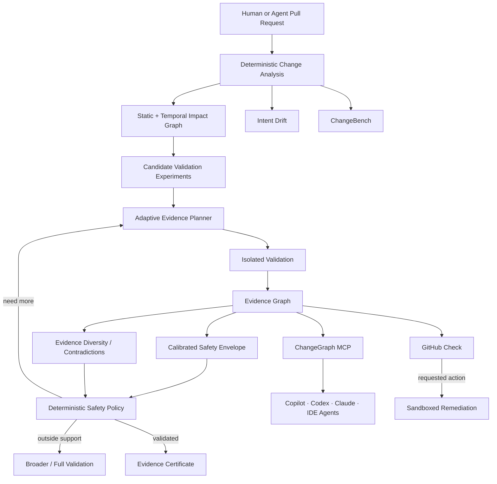

# ChangeGraph

> **Know when a change has enough evidence to ship.**

ChangeGraph is an AI-native **change-intelligence and adaptive validation layer for human and agent-authored code**.

It analyzes a pull request, maps changed symbols to the parts of a codebase they can affect, determines what evidence is required before the change should be trusted, adaptively acquires the cheapest useful validation evidence, explains risk inside GitHub, and can later let a coding agent attempt a fix inside an isolated sandbox.

The core principle is **deterministic evidence first, AI second**. Static code structure, dependency relationships, test links, runtime traces, Git history, mutation outcomes, invariants, repository policy, calibration, and provenance are the source of truth. LLMs explain findings and assist with hypothesis generation/remediation; they do not invent the impact graph or override safety policy.

## The research thesis

ChangeGraph is not ultimately a test-selection system. Its deeper research question is:

> **What is the minimum amount of trustworthy, sufficiently diverse evidence required to justify accepting a software change?**

A unit test is one evidence modality. Others include integration tests, runtime traces, mutation witnesses, invariants, metamorphic relations, builds, typechecks, historical failures, static dependency paths, and provenance.

Instead of computing one fixed test subset, ChangeGraph can eventually run one experiment, observe the result, update its uncertainty/evidence state, and choose the next highest-value experiment. If the evidence never becomes sufficient—or the current change falls outside the calibrated support region—it abstains and broadens validation.

## Why this exists

Modern coding agents can generate and modify code quickly, but teams still need to answer six hard questions:

1. What actually changed?
2. What can this change break?
3. Which validation evidence actually matters?
4. Is the evidence sufficiently independent/diverse to trust?
5. Does the implementation exceed the declared intent?
6. If a concrete gap exists, can an agent attempt a fix without getting unrestricted access to the developer machine?

Existing tools solve pieces of the problem. ChangeGraph combines semantic change analysis, temporal impact graphs, historical test intelligence, repository-specific trust, adaptive evidence planning, GitHub-native interaction, MCP, and isolated remediation into one evidence layer.

## Product promise

For a supported repository and pull request, ChangeGraph should eventually produce:

- changed files and changed symbols;
- a symbol-level dependency/impact graph;
- temporal change-propagation evidence;
- affected modules, routes, APIs, jobs, and tests;
- deterministic risk factors with contributing evidence;
- repository Trust state earned through shadow/full-suite comparison;
- Intent Drift between declared scope and actual blast radius;
- a minimum-evidence validation plan;
- an adaptive next-best validation experiment;
- evidence-diversity and contradiction information;
- bounded mutation witnesses for risky affected regions;
- runtime invariant drift where instrumentation exists;
- calibrated support/abstention status;
- a GitHub Check with annotations and requested actions;
- full-suite fallback whenever safety thresholds are not met;
- measured CI time and compute saved;
- MCP tools that let Copilot/Codex/Claude/IDE agents query the same evidence;
- later, an isolated agent workflow that can create a candidate regression test or fix;
- a verifiable ChangeGraph Evidence Certificate describing what was actually validated.

## Illustrative output

The values below demonstrate intended UX only. They are not benchmark claims.

```text
ChangeGraph / Pull Request #812

Risk                 HIGH
Repository Trust     TRUSTED
Calibration support  IN-DISTRIBUTION
Intent Drift         MEDIUM
Changed              7 files · 14 symbols
Evidence diversity   HIGH
Validation           4 adaptive actions
Full suite            611s estimated

Mutation witnesses
12 / 12 scoped mutants killed

Invariant drift
No critical affected invariant violated

Next-best evidence
Run auth integration suite
Expected value: high
Estimated cost: 43s

Potential regression
refreshSession() changed expiration semantics, but no pre-existing test
covers one impacted refresh-token path.
```

## Evidence Science research program

The post-MVP research program has four tracks.

### R1 — Causal Software Evolution

Temporal repository graphs, historical propagation channels, runtime relationships, and intervention evidence are used to study how changes propagate. Historical correlation remains labeled association unless stronger mechanistic/interventional evidence exists.

### R2 — Adaptive Evidence Validation

Validation is modeled as sequential evidence acquisition. At each step ChangeGraph chooses the experiment with the best expected uncertainty reduction and diversity gain per unit cost, then recomputes whether more evidence is needed.

This is the central long-term research thesis.

### R3 — Mutation and Invariant Evidence

Change-local mutations probe whether the current evidence set can detect plausible faults inside the predicted blast radius. Runtime invariant drift supplies another independent signal for affected regions.

### R4 — Verifiable Agentic Development

ChangeGraph tracks actor/evidence provenance, can require independent validation where code and tests share the same autonomous origin, supports shadow-validated metamorphic relations for oracle-poor systems, and can emit signed evidence certificates.

## Evidence modalities

```text
Static path
Runtime trace
Test result
Mutation witness
Likely invariant
Metamorphic relation
Historical failure/co-change
Coverage
Typecheck
Build
Security check
Repository policy
Provenance
```

LLM prose is not an evidence modality. An LLM may propose a test, invariant, or metamorphic relation, but it becomes evidence only after independent execution/validation under the documented lifecycle.

## Adaptive Evidence Validation

The stronger question is not:

> Which tests look relevant?

It is:

> Which validation experiment should we run next, and when do we have enough evidence to stop?

Conceptually:

```text
Change
  ↓
Impact hypotheses
  ↓
Candidate experiments
  ↓
Choose highest value / cost
  ↓
Run experiment
  ↓
Add evidence
  ↓
Recalculate diversity + calibration + policy
  ↓
Validated? Continue? Abstain? Full fallback?
```

The first planner remains deterministic and auditable. Learned/GNN models are challengers only after strong leak-free baselines exist.

## Mutation witnesses

ChangeGraph will eventually generate deterministic, bounded mutations only inside the changed/affected region. If the selected evidence fails to kill a plausible scoped mutant, the survivor becomes explicit negative evidence and may trigger another validation experiment.

A surviving mutant does **not** automatically mean a real defect exists. Equivalent/possibly-equivalent mutants are tracked separately.

## Calibrated Safety Envelope

ChangeGraph should not say:

> This PR is 99% safe.

Instead Optimize decisions must be tied to a versioned repository/change-regime calibration artifact. If a change is outside the observed support region or distribution shift is detected, ChangeGraph can abstain and broaden validation.

The UI language is:

> **within the current calibrated safety envelope**

rather than an unconditional probability-of-safety claim.

## Proof-Carrying Pull Requests

A successfully validated change may later produce a **ChangeGraph Evidence Certificate** containing:

- exact base/head commit;
- analyzer/policy/calibration versions;
- canonical evidence digests;
- validation experiments and outcomes;
- decision;
- Merkle evidence root;
- signature/provenance metadata.

The certificate proves what evidence was observed and what policy accepted it. It does **not** prove that the software is bug-free or secure.

## Platform surfaces

### GitHub App

Pull-request Checks, annotations, evidence summaries, trust, Intent Drift, calibration status, and native requested actions.

### GitHub Action

A separate Marketplace-ready Action for workflow-native/self-hosted adoption.

### ChangeGraph MCP

Read-only tools can include:

```text
analyze_change
get_changed_symbols
get_impact_paths
get_relevant_tests
get_repository_trust
compare_intent_to_impact
minimum_evidence_plan
evidence_summary
next_best_experiment
mutation_witnesses
invariant_drift
calibration_status
```

The same MCP surface can be consumed by GitHub Copilot, Codex/ChatGPT-compatible clients, Claude Code, Cursor, VS Code agents, and other MCP hosts.

### GitHub Copilot custom agent

A specialized **ChangeGraph Reviewer** consumes ChangeGraph MCP evidence rather than inventing its own blast-radius analysis.

### ChangeBench

An open benchmark for measuring failing-test recall, false-safe rate, validation/runtime reduction, calibration behavior, mutation retention, evidence diversity, and adaptive-evidence efficiency using controlled fixtures and temporally valid historical replay.

### Public playground

Eventually, paste a public GitHub PR URL and receive a read-only impact/evidence report without installing the App.

## Architecture at a glance



## Product modes

### 1. Observe / Advisory

ChangeGraph analyzes risk/evidence but does not control CI. New repositories always begin here.

### 2. Recommend

After enough calibration evidence exists, ChangeGraph recommends an optimized validation plan while existing full CI remains authoritative.

### 3. Optimize

Adaptive/reduced validation may execute only when repository Trust, calibration support, and safety policy permit it. Unsupported or out-of-support changes broaden validation automatically.

### 4. Agent remediation

After a concrete evidence gap is identified, a user may request a candidate test/fix inside an isolated sandbox. Output is reviewable and never auto-merged.

## Repository Trust

ChangeGraph must **earn authority**.

```text
UNPROVEN -> OBSERVED -> CALIBRATING -> TRUSTED
                               ↘
                          DEGRADED / SUSPENDED
```

Trust is based on measurable shadow/full-suite evidence, systematic misses, index health, adapter stability, calibration behavior, and explicit repository-owner opt-in.

## Safety invariants

ChangeGraph is only impressive if it is trustworthy.

- Unsupported language/build behavior is never silently treated as understood.
- Low analysis confidence or calibration-support mismatch means broader validation.
- Hard-fallback changes can force the full suite.
- Adaptive/selective validation is opt-in per repository.
- Repository Trust is earned through measured calibration.
- Co-change/co-failure is never silently called causal proof.
- Same-origin agent code/tests are not automatically counted as independent evidence.
- Mined invariants are likely invariants, not formal proofs.
- LLM-proposed metamorphic relations must be executable and validated before becoming trusted evidence.
- MCP V1 is read-only by default.
- Agent tools cannot override deterministic safety policy.
- Intent text can never reduce deterministic risk.
- Agent execution is isolated and cannot merge automatically.
- Evidence certificates attest to observed evidence; they do not guarantee security or absence of bugs.
- Every recommendation exposes inspectable provenance.

## Target success metrics

Initial product targets include:

- >= 99% recall of tests that fail in the full suite for supported change classes;
- >= 50% median reduction in executed tests on safe pull requests;
- >= 40% median CI wall-clock reduction where test execution dominates runtime;
- <= 0.5% protected false-safe rate;
- 100% full-suite fallback on explicitly unsupported or low-confidence cases;
- every risk/selection item linked to concrete evidence.

Evidence Science adds hypotheses around adaptive validation cost, mutation witness usefulness, calibration under shift, evidence diversity, temporal propagation, and independent agent evidence.

These are **evaluation targets/hypotheses, not claims about current performance**.

ChangeBench is responsible for turning them into reproducible measured results.

## GitHub Marketplace direction

The first Marketplace release should be a **free GitHub App**. A separate ChangeGraph Action can follow through the GitHub Actions Marketplace path.

The project will not pursue paid plans until installation, benchmark, support, security, and publisher requirements justify them.

## Repository status

**Status: research, architecture, core MVP specification, GitHub-native platform expansion, and Evidence Science research design are complete. Production implementation has not started.**

## Documentation

### Core

- [Core design specification](docs/superpowers/specs/2026-09-04-changegraph-design.md)
- [Core technical architecture](docs/ARCHITECTURE.md)
- [Architecture decisions](docs/DECISIONS.md)
- [Original research landscape](docs/RESEARCH.md)
- [Product roadmap](docs/ROADMAP.md)
- [Recruiter / portfolio demo strategy](docs/PORTFOLIO_DEMO.md)
- [MVP implementation plan](docs/superpowers/plans/2026-09-04-changegraph-mvp.md)

### Platform expansion

- [Platform expansion design](docs/superpowers/specs/2026-09-04-changegraph-platform-expansion-design.md)
- [Platform architecture](docs/PLATFORM_ARCHITECTURE.md)
- [Platform research](docs/PLATFORM_RESEARCH.md)
- [GitHub Marketplace launch plan](docs/MARKETPLACE.md)
- [Platform expansion implementation plan](docs/superpowers/plans/2026-09-04-changegraph-platform-expansion.md)

### Evidence Science

- [Evidence Science design](docs/superpowers/specs/2026-09-04-changegraph-evidence-science-design.md)
- [Evidence Science research program](docs/EVIDENCE_SCIENCE_RESEARCH.md)
- [Evidence Science implementation plan](docs/superpowers/plans/2026-09-04-changegraph-evidence-science.md)

### Agent guidance

- [Agent implementation guardrails](AGENTS.md)

## Current stack decision

Core baseline:

- Node.js 24 LTS
- TypeScript 6
- Next.js 16.3.x with current security patches
- React 19.2-compatible release
- pnpm 10 workspaces
- PostgreSQL
- Drizzle ORM
- GitHub App + Webhooks + Checks API
- TypeScript Compiler API for V1 symbol analysis
- Vitest 5
- OpenTelemetry
- Docker-isolated test runners

Evidence Science adds packages for:

- temporal history;
- canonical evidence/provenance;
- validation experiments;
- mutation witnesses;
- calibration/shift diagnostics;
- runtime invariants;
- metamorphic relations;
- evidence attestations.

## Long-term direction

The end state is not “AI code review.”

It is an **evidence-science substrate for human and agent-authored software**: a system that knows what changed, what can be affected, which evidence actually matters, what experiment should be run next, whether the current change is inside its calibrated understanding, and when it does not know enough to optimize safely.
