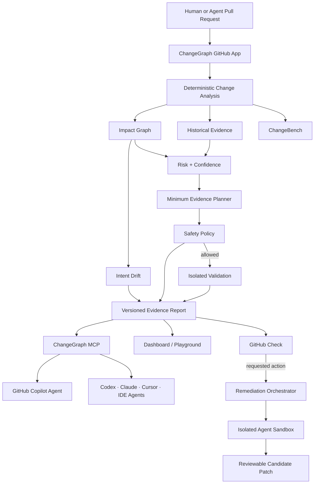

# ChangeGraph

> **Know what your code can break.**

ChangeGraph is an AI-native **change-intelligence layer for human and agent-authored code**.

It analyzes a pull request, maps changed symbols to the parts of a codebase they can affect, determines what evidence is required before the change should be trusted, recommends the minimum safe validation plan, explains risk inside GitHub, and can later let a coding agent attempt a fix inside an isolated sandbox.

The core principle is **deterministic evidence first, AI second**. Static code structure, dependency relationships, test links, Git history, execution history, repository policy, and calibration are the source of truth. LLMs explain findings and assist with remediation; they do not invent the impact graph or override safety policy.

## Why this exists

Modern coding agents can generate and modify code quickly, but teams still need to answer five hard questions:

1. What actually changed?
2. What can this change break?
3. Which validation evidence actually matters?
4. Does the implementation exceed the declared intent?
5. If a concrete gap exists, can an agent attempt a fix without getting unrestricted access to the developer machine?

Existing tools solve pieces of the problem. ChangeGraph combines semantic change analysis, explainable impact graphs, historical test intelligence, repository-specific trust, selective validation, GitHub-native interaction, MCP, and isolated remediation into one evidence layer.

## Product promise

For a supported repository and pull request, ChangeGraph should produce:

- changed files and changed symbols;
- a symbol-level dependency/impact graph;
- affected modules, routes, APIs, jobs, and tests;
- a deterministic risk score with contributing evidence;
- a confidence score describing how well ChangeGraph understands the change;
- repository Trust state earned through shadow/full-suite comparison;
- Intent Drift between declared scope and actual blast radius;
- a minimum-evidence validation plan;
- a GitHub Check with annotations and requested actions;
- full-suite fallback whenever safety thresholds are not met;
- measured CI time and compute saved;
- MCP tools that let Copilot/Codex/Claude/IDE agents query the same evidence;
- later, an isolated agent workflow that can create a candidate regression test or fix.

## Illustrative output

The values below demonstrate the intended UX only. They are not benchmark claims.

```text
ChangeGraph / Pull Request #812

Risk             HIGH (82/100)
Confidence       93%
Repository Trust TRUSTED
Intent Drift     MEDIUM
Changed          7 files · 14 symbols
Affected         auth · sessions · user API
Validation       3 actions · 73s estimated
Full suite       611s estimated

Potential regression
refreshSession() changed expiration semantics, but no test covering
refresh-token expiry is linked to the changed path.

Minimum evidence plan
1. refresh-session.test.ts   +0.08 confidence   12s
2. auth-middleware.test.ts   +0.05 confidence   18s
3. auth integration suite    +0.06 confidence   43s

Why these tests?
login.test.ts        direct caller path, distance 2
session.test.ts      symbol dependency, distance 1
refresh.test.ts      historical co-failure signal
middleware.test.ts   affected route dependency
```

## Platform surfaces

ChangeGraph is designed to appear where developers already work.

### GitHub App

Pull-request Checks, annotations, evidence summaries, trust, Intent Drift, and native requested actions.

### GitHub Action

A separate Marketplace-ready Action for workflow-native/self-hosted adoption.

### ChangeGraph MCP

Read-only tools such as:

```text
analyze_change
get_changed_symbols
get_impact_paths
get_relevant_tests
get_risk
get_confidence
get_repository_trust
compare_intent_to_impact
minimum_evidence_plan
```

The same MCP surface can be consumed by GitHub Copilot, Codex/ChatGPT-compatible clients, Claude Code, Cursor, VS Code agents, and other MCP hosts.

### GitHub Copilot custom agent

A specialized **ChangeGraph Reviewer** agent consumes ChangeGraph MCP evidence rather than inventing its own blast-radius analysis.

### ChangeBench

An open benchmark for measuring failing-test recall, false-safe rate, test/runtime reduction, confidence calibration, and minimum-evidence efficiency using controlled fixtures and temporally valid historical replay.

### Public playground

Eventually, paste a public GitHub PR URL and receive a read-only impact report without installing the App.

## Architecture at a glance



## Product modes

### 1. Observe / Advisory

ChangeGraph analyzes risk and recommends evidence but does not control CI. New repositories always begin here.

### 2. Recommend

After enough calibration evidence exists, ChangeGraph can recommend an optimized validation plan while existing full CI remains authoritative.

### 3. Optimize

Reduced validation may execute only when repository Trust, confidence, and safety policy permit it. Unsafe or unsupported changes automatically trigger the full suite.

### 4. Agent remediation

After ChangeGraph identifies a concrete missing test or likely failure, a user may request a candidate patch inside an isolated sandbox. Output is always reviewable and never auto-merged.

## Repository Trust

ChangeGraph must **earn authority**.

```text
UNPROVEN -> OBSERVED -> CALIBRATING -> TRUSTED
                               ↘
                          DEGRADED / SUSPENDED
```

Trust is based on measurable shadow/full-suite evidence, systematic misses, index health, adapter stability, and explicit repository-owner opt-in. A serious false-safe event can immediately degrade or suspend optimization.

## Intent Drift

ChangeGraph compares declared scope with detected impact.

```text
Declared: session refresh

Detected additional impact:
- auth middleware
- dashboard authorization
- user API
- refresh-token persistence

Intent Drift: HIGH
```

Intent Drift is a review signal, not a replacement for deterministic risk analysis.

## Minimum Evidence Testing

ChangeGraph's stronger question is not simply:

> Which tests look relevant?

It is:

> What is the cheapest validation plan that satisfies the repository's confidence and safety constraints?

Evidence may include tests, integration suites, typecheck, build, schema checks, sentinels, or full-suite validation.

No optimization step may remove protected safety requirements.

## Initial language scope

V1 intentionally focuses on **TypeScript/JavaScript repositories** with **Vitest and Jest**. The architecture supports later adapters for Python/pytest and language-independent semantic indexes such as SCIP.

## Safety invariants

ChangeGraph is only impressive if it is trustworthy.

- Unsupported language/build behavior is never silently treated as understood.
- Low analysis confidence means broader validation.
- Hard-fallback changes can force the full suite.
- Selective CI is opt-in per repository.
- Repository Trust is earned through measured calibration.
- MCP V1 is read-only by default.
- Agent tools cannot override deterministic safety policy.
- Intent text can never reduce deterministic risk.
- Agent execution is isolated and cannot merge automatically.
- Every recommendation exposes evidence: dependency path, history signal, coverage link, policy reason, or explicit heuristic.
- LLM output cannot override risk, confidence, Trust, or policy.

## Target success metrics

The initial product targets on benchmark repositories include:

- >= 99% recall of tests that fail in the full suite for supported change classes;
- >= 50% median reduction in executed tests on safe pull requests;
- >= 40% median CI wall-clock reduction where test execution dominates runtime;
- <= 0.5% protected false-safe rate;
- 100% full-suite fallback on explicitly unsupported or low-confidence cases;
- every risk/selection item linked to concrete evidence.

These are **evaluation targets, not claims about current performance**.

ChangeBench is responsible for turning these targets into reproducible measured results.

## GitHub Marketplace direction

The first Marketplace release should be a **free GitHub App**.

A separate ChangeGraph Action can be published through the GitHub Actions Marketplace path.

The project will not pursue paid plans until installation, benchmark, support, security, and publisher requirements justify them.

## Repository status

**Status: research, architecture, core MVP specification, and GitHub-native platform expansion planning complete. Production implementation has not started.**

## Documentation

### Core

- [Core design specification](docs/superpowers/specs/2026-09-04-changegraph-design.md)
- [Core technical architecture](docs/ARCHITECTURE.md)
- [Architecture decisions](docs/DECISIONS.md)
- [Original research landscape](docs/RESEARCH.md)
- [Product roadmap](docs/ROADMAP.md)
- [Recruiter / portfolio demo strategy](docs/PORTFOLIO_DEMO.md)
- [MVP implementation plan](docs/superpowers/plans/2026-09-04-changegraph-mvp.md)

### Platform expansion

- [Platform expansion design](docs/superpowers/specs/2026-09-04-changegraph-platform-expansion-design.md)
- [Platform architecture](docs/PLATFORM_ARCHITECTURE.md)
- [Platform research](docs/PLATFORM_RESEARCH.md)
- [GitHub Marketplace launch plan](docs/MARKETPLACE.md)
- [Platform expansion implementation plan](docs/superpowers/plans/2026-09-04-changegraph-platform-expansion.md)

### Agent guidance

- [Agent implementation guardrails](AGENTS.md)

## Current stack decision

Core baseline:

- Node.js 24 LTS
- TypeScript 6
- Next.js 16.3.x with the current security patch line
- React 19.2-compatible release
- pnpm 10 workspaces
- PostgreSQL
- Drizzle ORM
- GitHub App + Webhooks + Checks API
- TypeScript Compiler API for V1 symbol analysis
- Vitest 5
- OpenTelemetry
- Docker-isolated test runners

Expansion baseline:

- MCP TypeScript SDK compatible with the MCP 2026-07-28 specification line
- GitHub Copilot custom-agent profiles
- GitHub Checks requested actions
- ChangeBench replay/baseline framework
- evidence-bound sandboxed remediation

## Long-term direction

The end state is not “AI code review.”

It is a **change-intelligence substrate for human and agent-authored software**: a system that knows what changed, what can be affected, what evidence exists, how much validation is necessary, when declared intent diverges from reality, and when it does not know enough to optimize safely.
