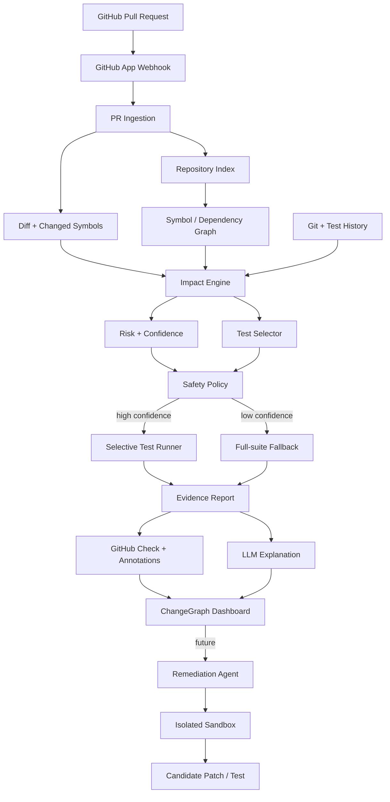

# ChangeGraph

> AI-native pull-request intelligence and selective CI for safer, faster software delivery.

ChangeGraph analyzes a pull request, maps changed symbols to the parts of a codebase they can affect, ranks the tests most likely to catch regressions, runs the smallest safe test set, explains risk in GitHub, and can later let a coding agent attempt a fix inside an isolated sandbox.

The core principle is **deterministic evidence first, AI second**. Static code structure, dependency relationships, test links, Git history, and execution history are the source of truth. LLMs explain findings and assist with remediation; they do not invent the impact graph.

## Why this exists

Modern coding agents can generate and modify code quickly, but teams still need to answer four hard questions on every pull request:

1. What can this change break?
2. Which tests actually matter for this change?
3. Is skipping the rest of the suite safe?
4. If risk is found, can an agent propose a fix without getting unrestricted access to the developer machine?

Existing tools solve parts of this problem. Monorepo systems such as Nx use project graphs to run affected tasks. Predictive test-selection systems learn from historical changes and test failures. GitHub provides native Checks and annotations. Docker now provides microVM-isolated coding-agent sandboxes. ChangeGraph combines these ideas into a GitHub-native, symbol-aware developer tool.

## Product promise

For a supported repository and pull request, ChangeGraph should produce:

- changed files and changed symbols;
- a symbol-level dependency/impact graph;
- affected modules, routes, APIs, jobs, and tests;
- a deterministic risk score with an explanation of contributing factors;
- a ranked test plan;
- a confidence score for selective execution;
- a GitHub Check with annotations and a human-readable report;
- full-suite fallback whenever safety thresholds are not met;
- measured CI time and compute saved;
- later, an isolated agent workflow that can create a candidate regression test or fix.

## Illustrative output

The values below demonstrate the intended UX only. They are not benchmark claims.

```text
ChangeGraph / Pull Request #812

Risk            HIGH (82/100)
Confidence      93%
Changed         7 files · 14 symbols
Affected        auth · sessions · user API
Recommended     41 / 387 tests
Predicted save  8m 12s

Potential regression
refreshSession() changed expiration semantics, but no test covering
refresh-token expiry is linked to the changed path.

Why these tests?
login.test.ts        direct caller path, distance 2
session.test.ts      symbol dependency, distance 1
refresh.test.ts      historical co-failure score 0.87
middleware.test.ts   affected route dependency
```

## Architecture at a glance



## Product modes

### 1. Advisory mode
ChangeGraph analyzes risk and recommends tests but does not control CI. This is the first production-safe mode and the default for new installations.

### 2. Selective CI mode
ChangeGraph runs a reduced test set only when confidence and repository policy permit it. Unsafe or unsupported changes automatically trigger the full suite.

### 3. Agent remediation mode
After ChangeGraph identifies a missing regression test or likely failure, an agent may attempt a patch inside an isolated sandbox. The output is always a reviewable candidate branch or pull request, never an automatic merge.

## Initial language scope

V1 intentionally focuses on **TypeScript/JavaScript repositories** with **Vitest and Jest**. The architecture must support later adapters for Python/pytest and language-independent indexes such as SCIP/Tree-sitter based indexers.

## Safety invariants

ChangeGraph is only impressive if it is trustworthy.

- No unsupported language or build graph is silently treated as understood.
- Low analysis confidence means full-suite fallback.
- Lockfile, build-system, CI configuration, test-runner configuration, security-policy, migration, or other repository-wide changes can force full-suite execution.
- Selective CI is opt-in per repository.
- Agent execution is isolated and cannot merge automatically.
- Every recommendation must expose evidence: dependency path, history signal, coverage link, or explicit heuristic.
- LLM output cannot override deterministic safety policy.

## Target success metrics

The MVP is successful when it demonstrates all of the following on benchmark repositories:

- >= 99% recall of tests that fail in the full suite for supported change classes;
- >= 50% median reduction in executed tests on safe pull requests;
- >= 40% median CI wall-clock reduction where test execution dominates runtime;
- <= 0.5% false-safe rate in protected evaluation mode;
- 100% full-suite fallback on explicitly unsupported or low-confidence cases;
- GitHub check posted within 15 seconds of completing analysis, excluding test runtime;
- every risk item links back to concrete evidence.

These are evaluation targets, not claims about current performance.

## Repository status

**Status: research, architecture, product specification, and implementation planning complete. Production implementation has not started.**

## Documentation

- [Design specification](docs/superpowers/specs/2026-09-04-changegraph-design.md)
- [Technical architecture](docs/ARCHITECTURE.md)
- [Architecture decisions](docs/DECISIONS.md)
- [Research landscape](docs/RESEARCH.md)
- [Product roadmap](docs/ROADMAP.md)
- [Recruiter / portfolio demo strategy](docs/PORTFOLIO_DEMO.md)
- [MVP implementation plan](docs/superpowers/plans/2026-09-04-changegraph-mvp.md)
- [Agent implementation guardrails](AGENTS.md)

## Current stack decision

- Node.js 24 LTS
- TypeScript 6
- Next.js 16.3.x with the current security patch line
- React 19.2-compatible release
- pnpm 10 workspaces
- PostgreSQL
- Drizzle ORM
- GitHub App + Webhooks + Checks API
- TypeScript Compiler API for V1 symbol analysis
- Vitest 5 for ChangeGraph's own tests
- OpenTelemetry for traces/metrics
- Docker-isolated test runners; Docker Sandboxes for the later agent-remediation path

## Long-term direction

The end state is not “AI code review.” It is a **change-intelligence layer for human and agent-authored code**: a system that knows what changed, what can be affected, what evidence exists, how much validation is necessary, and when it does not know enough to optimize safely.
