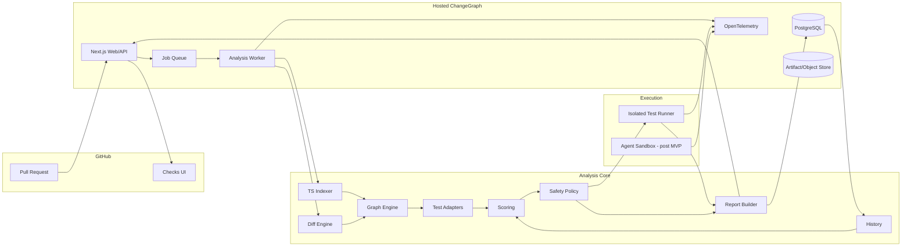

# ChangeGraph Technical Architecture

This document turns the product specification into concrete service boundaries, algorithms, interfaces, data flow, security controls, and deployment responsibilities.

## 1. Architecture goals

The architecture must optimize for five properties in this order:

1. **Safety:** uncertainty must cause broader validation, never less.
2. **Explainability:** every selection and warning must be traceable to evidence.
3. **Determinism:** core analysis must be reproducible without an LLM.
4. **Incrementality:** unchanged repository state should not be re-indexed unnecessarily.
5. **Extensibility:** new languages, test runners, CI backends, and model providers should be adapters rather than rewrites.

## 2. Topology



## 3. Repository layout

```text
changegraph/
├── apps/
│   ├── web/
│   │   ├── app/
│   │   ├── components/
│   │   └── lib/
│   ├── worker/
│   │   └── src/
│   └── cli/
│       └── src/
├── packages/
│   ├── config/
│   ├── db/
│   ├── github/
│   ├── repo/
│   ├── diff/
│   ├── indexer-ts/
│   ├── graph/
│   ├── tests-core/
│   ├── test-vitest/
│   ├── test-jest/
│   ├── history/
│   ├── scoring/
│   ├── policy/
│   ├── report/
│   ├── llm/
│   └── telemetry/
├── fixtures/
│   ├── ts-basic/
│   ├── ts-monorepo/
│   ├── vitest-basic/
│   ├── jest-basic/
│   └── unsafe-config-change/
├── benchmarks/
│   └── src/
├── docs/
└── .github/
```

The web application is not allowed to own analysis logic. Analysis packages must remain runnable from the CLI and worker.

---

## 4. Canonical domain model

### Repository identity

```ts
export interface RepositoryRef {
  host: 'github';
  owner: string;
  name: string;
  repositoryId: number;
}
```

### Commit range

```ts
export interface CommitRange {
  baseSha: string;
  headSha: string;
}
```

### Source location

```ts
export interface SourceLocation {
  filePath: string;
  startLine: number;
  endLine: number;
  startColumn?: number;
  endColumn?: number;
}
```

### Graph node

```ts
export type GraphNodeKind =
  | 'package'
  | 'file'
  | 'module'
  | 'function'
  | 'class'
  | 'method'
  | 'variable'
  | 'type'
  | 'interface'
  | 'route'
  | 'test-file'
  | 'test-case';

export interface GraphNode {
  id: string;
  stableKey: string;
  kind: GraphNodeKind;
  name: string;
  location?: SourceLocation;
  exported: boolean;
  contentHash?: string;
  metadata: Record<string, string | number | boolean | null>;
}
```

### Graph edge

```ts
export type GraphEdgeKind =
  | 'contains'
  | 'imports'
  | 'exports'
  | 'reexports'
  | 'calls'
  | 'references'
  | 'extends'
  | 'implements'
  | 'route-uses'
  | 'tests'
  | 'depends-on-package';

export interface GraphEdge {
  id: string;
  source: string;
  target: string;
  kind: GraphEdgeKind;
  confidence: number;
  evidence?: SourceLocation;
}
```

### Evidence record

```ts
export type EvidenceKind =
  | 'static-path'
  | 'coverage'
  | 'history'
  | 'path-affinity'
  | 'policy'
  | 'fallback';

export interface EvidenceRecord {
  id: string;
  kind: EvidenceKind;
  summary: string;
  score?: number;
  graphPath?: string[];
  location?: SourceLocation;
  metadata?: Record<string, unknown>;
}
```

---

## 5. Pull-request event flow

### 5.1 Webhook receipt

1. Receive event on `/api/github/webhook`.
2. Read raw request body before JSON parsing.
3. Verify `X-Hub-Signature-256` using constant-time comparison.
4. Record `X-GitHub-Delivery` as deduplication key.
5. Validate event/action against subscribed events.
6. Persist a compact event envelope.
7. Enqueue analysis.
8. Return `2xx` quickly. Heavy work never blocks webhook acknowledgement.

### 5.2 Supersession

For one repository/PR, only the newest head SHA should remain authoritative.

If PR head changes from `A` to `B`:

- analysis for `A` receives `cancelled_superseded` if still running;
- queued work for `A` is discarded;
- check run for `A` may remain in GitHub history but is not updated as current;
- analysis for `B` gets a new report/check.

### 5.3 Idempotency

The natural idempotency key is:

`github:{installationId}:{repoId}:pr:{number}:{headSha}`

A re-delivered webhook should find the existing run rather than duplicate execution.

---

## 6. Repository checkout and cache strategy

### 6.1 Checkout abstraction

```ts
export interface RepositoryWorkspace {
  root: string;
  repository: RepositoryRef;
  commit: string;
  dispose(): Promise<void>;
}

export interface RepositoryProvider {
  checkout(repository: RepositoryRef, sha: string): Promise<RepositoryWorkspace>;
}
```

Hosted workers should use ephemeral workspaces. Local CLI uses the current checkout.

### 6.2 Cache keys

- file parse: `indexerVersion + fileContentHash + compilerConfigHash`;
- module resolution: `indexerVersion + importerHash + tsconfigHash + lockfileHash`;
- repository graph: `commitSha + indexerVersion`;
- test inventory: `commitSha + runnerAdapterVersion + runnerConfigHash`.

### 6.3 Cache invalidation

Changes to `tsconfig`, package resolution, or lockfiles invalidate broader portions of the graph and trigger safety fallback for that PR.

---

## 7. TypeScript indexer

### 7.1 Why TypeScript Compiler API first

For V1, TypeScript/JavaScript is the product's deepest supported ecosystem. The compiler API provides syntax trees, symbols, types, and module resolution in a single language-aware system, avoiding the need to reconstruct TypeScript semantics on top of a generic parser.

### 7.2 Index phases

1. Locate relevant `tsconfig.json` files.
2. Build compiler programs.
3. Enumerate source files excluding generated/vendor patterns.
4. Create file/module nodes.
5. Walk declarations to create symbol nodes.
6. Record import/export/re-export edges.
7. Use type checker to resolve symbol references.
8. Create call/reference edges when statically resolvable.
9. Emit route metadata through framework detectors.
10. Record unresolved edges and their reason.

### 7.3 Stable keys

A symbol stable key must survive unrelated line movement:

`{package}:{normalizedFilePath}:{kind}:{qualifiedSymbolName}`

For anonymous callbacks that cannot be named reliably, use file-level impact rather than inventing unstable identity.

### 7.4 Dynamic behavior

The indexer explicitly records uncertainty for:

- computed module specifiers;
- `eval`/`new Function`;
- runtime plugin loading;
- dependency injection that cannot be resolved;
- metaprogramming/reflection patterns.

This uncertainty feeds confidence and policy.

---

## 8. Diff-to-symbol engine

Inputs:

- base file content;
- head file content;
- diff hunks;
- base/head AST/index records.

Algorithm:

1. Normalize changed ranges on both sides.
2. For each range, find smallest containing declaration node.
3. Compare base/head signatures.
4. Compare export state.
5. Record semantic change type.
6. If no reliable declaration contains the range, emit a file-level change.

Output:

```ts
export interface ChangedEntity {
  stableKey: string;
  kind: GraphNodeKind | 'file';
  changeType:
    | 'added'
    | 'removed'
    | 'body'
    | 'signature'
    | 'export'
    | 'dependency'
    | 'unknown';
  baseLocation?: SourceLocation;
  headLocation?: SourceLocation;
  exported: boolean;
}
```

---

## 9. Graph traversal and impact expansion

### 9.1 Traversal direction

To discover what a changed symbol may affect, traverse **reverse dependency** relationships.

Example:

`changed function -> callers -> route -> test`

### 9.2 Edge weights

Not every relation is equally strong.

Initial traversal cost:

| Edge | Cost |
|---|---:|
| direct `tests` / dynamic coverage | 0.25 |
| `calls` | 1.00 |
| `references` | 1.00 |
| `imports` | 1.25 |
| `route-uses` | 1.00 |
| `depends-on-package` | 1.50 |
| convention/path relationship | 2.00 |

Use weighted shortest-path distance when available. The product specification's `1/(1+d)` static score uses normalized distance.

### 9.3 Traversal budget

Protect workers from pathological graphs:

- maximum default depth: 8;
- maximum default affected nodes: 25,000;
- maximum default impact paths retained per target: 3.

Exceeding the budget does not truncate silently. It sets `analysis_truncated=true`, lowers confidence, and normally forces full-suite fallback.

---

## 10. Test framework architecture

### 10.1 Core types

```ts
export interface TestCaseRef {
  id: string;
  framework: 'vitest' | 'jest';
  filePath: string;
  name?: string;
}

export interface TestInventory {
  framework: 'vitest' | 'jest';
  tests: TestCaseRef[];
  setupFiles: string[];
  configFiles: string[];
}

export interface TestSelection {
  tests: TestCaseRef[];
  mandatoryTests: TestCaseRef[];
  skippedTests: TestCaseRef[];
  reasons: Record<string, string[]>;
}

export interface RunnerCommand {
  executable: string;
  args: string[];
  cwd: string;
  env: Record<string, string>;
}
```

Arguments must be passed as arrays to process APIs, never concatenated into shell strings.

### 10.2 Result normalization

```ts
export type TestStatus = 'passed' | 'failed' | 'skipped' | 'flaky';

export interface TestCaseResult {
  test: TestCaseRef;
  status: TestStatus;
  durationMs?: number;
  failureSignatureHash?: string;
}
```

Adapters normalize framework output into this common model.

---

## 11. Static and historical test mapping

### 11.1 Static candidates

A test becomes a candidate when:

- it directly imports an affected file;
- its dependency graph reaches an affected symbol/file;
- a coverage link associates it with an affected symbol;
- historical evidence links it to the changed area;
- it is a repository sentinel.

### 11.2 Path affinity

Path affinity is deliberately weak.

Example heuristic:

- same package: `1.0`;
- same top-level source directory: `0.6`;
- matching basename stem: `0.8`;
- repository-wide unrelated path: `0.0`.

It contributes only 10% to initial test priority.

### 11.3 Historical decay

Recent runs should matter more than very old topology.

For run age `days`:

`weight = exp(-days / 90)`

The historical aggregation stores weighted counts and raw counts for auditability.

---

## 12. Risk and confidence engine

Implement risk and confidence as separate packages and values.

**Risk** asks “How much validation does this change deserve?”  
**Confidence** asks “How much do we understand?”

A high-risk, high-confidence PR may still be selectively testable if its affected tests are known. A low-risk, low-confidence PR may still require full suite because ChangeGraph lacks understanding.

### 12.1 Feature normalization

All scoring inputs are clamped to `[0,1]`. Each input includes raw value and normalization explanation in the report.

### 12.2 Versioning

Every report stores:

- `riskModelVersion`;
- `confidenceModelVersion`;
- `testPriorityVersion`;
- `policyVersion`.

Reproducibility requires old reports to remain interpretable after weights evolve.

---

## 13. Safety policy engine

The policy engine is pure and deterministic:

```ts
export interface PolicyInput {
  risk: RiskAssessment;
  confidence: ConfidenceAssessment;
  changeFacts: ChangeFacts;
  repositoryPolicy: RepositoryPolicy;
}

export type ExecutionDecision =
  | { kind: 'advisory'; reasons: string[] }
  | { kind: 'selective'; reasons: string[] }
  | { kind: 'full-fallback'; reasons: string[] };

export function decideExecution(input: PolicyInput): ExecutionDecision;
```

It has no network calls and no LLM access.

### Precedence

1. hard fallback trigger;
2. trust mode;
3. confidence threshold;
4. selection viability;
5. repository override where allowed.

A repository policy may make safety stricter. V1 must not allow policy to disable non-overridable security/runtime fallbacks.

---

## 14. Shadow-mode calibration

For each full run, derive a counterfactual:

```text
selected_by_changegraph ∩ actual_failures
```

Metrics:

```text
failure_recall = selected_failing_tests / all_failing_tests
selection_ratio = selected_tests / all_tests
runtime_ratio = selected_test_duration / all_test_duration
```

A miss gets a structured cause category:

- static graph miss;
- unresolved dynamic dependency;
- missing test inventory;
- history cold start;
- framework adapter issue;
- selection threshold issue;
- unrelated/flaky failure;
- unknown.

This classification is required before model/policy tuning.

---

## 15. GitHub Checks publisher

Only the GitHub integration layer knows API payload shape.

```ts
export interface CheckPublisher {
  start(reportSeed: AnalysisIdentity): Promise<{ checkRunId: number }>;
  complete(checkRunId: number, report: ChangeGraphReportV1): Promise<void>;
  fail(checkRunId: number, failure: AnalysisFailure): Promise<void>;
}
```

### Output limits

GitHub API output/annotation limits require pagination/batching. The internal report is authoritative; GitHub receives a concise projection.

### Conclusion semantics

- advisory warning does not fail a PR by default;
- selective/full validation failure returns failure;
- analysis infrastructure failure returns neutral/error according to configured branch policy, never success;
- hard fallback followed by passing full suite is success with fallback explanation.

---

## 16. Dashboard architecture

The dashboard reads immutable reports and aggregate statistics rather than rerunning analysis in request handlers.

### Key routes

```text
/
/repos
/repos/[owner]/[name]
/repos/[owner]/[name]/pull/[number]
/repos/[owner]/[name]/settings
```

### Impact graph rendering

For large graphs, the server sends only a focused subgraph around changed entities and selected tests. Expansion requests fetch more nodes on demand.

Never attempt to render all 25,000 nodes in the browser.

---

## 17. LLM boundary

### Input contract

```ts
export interface ExplanationRequest {
  report: ChangeGraphReportV1;
  evidenceIds: string[];
  maxFindings: number;
}
```

The model returns structured findings:

```ts
export interface ExplanationFinding {
  title: string;
  summary: string;
  evidenceIds: string[];
  suggestedTestScenario?: string;
}
```

A finding with unknown evidence IDs is rejected.

### Provider abstraction

```ts
export interface ExplanationProvider {
  explain(request: ExplanationRequest): Promise<ExplanationFinding[]>;
}
```

No provider-specific types escape `packages/llm`.

---

## 18. Agent remediation boundary

Post-MVP remediation consumes an immutable ChangeGraph report and creates an isolated job.

```ts
export interface RemediationTask {
  repository: RepositoryRef;
  headSha: string;
  kind: 'add-regression-test' | 'attempt-fix';
  evidenceIds: string[];
}
```

### Sandbox backend contract

```ts
export interface SandboxBackend {
  create(task: RemediationTask): Promise<SandboxSession>;
  execute(session: SandboxSession, command: RunnerCommand): Promise<ProcessResult>;
  diff(session: SandboxSession): Promise<string>;
  destroy(session: SandboxSession): Promise<void>;
}
```

Docker Sandboxes may implement this backend later; tests use a fake backend.

---

## 19. Database strategy

Use PostgreSQL as the primary database.

### Why not start with a graph database

V1 graph operations are bounded per repository/index and mostly involve traversal over an in-memory adjacency structure during analysis. Persisting normalized nodes/edges in Postgres is operationally simpler and supports recursive queries/debugging. A dedicated graph database should only be introduced if measured workloads prove it necessary.

### Large artifacts

Do not put raw source archives or huge reports in relational columns. Store compact structured reports in Postgres and large ephemeral artifacts in object storage if required.

---

## 20. Queue / worker semantics

The architecture requires durable background work but does not require a particular queue vendor in the core packages.

```ts
export interface AnalysisJob {
  analysisId: string;
  repository: RepositoryRef;
  pullNumber: number;
  baseSha: string;
  headSha: string;
}
```

Worker behavior:

1. acquire job;
2. confirm analysis is still current;
3. checkout;
4. index/analyze;
5. run policy;
6. optionally execute tests;
7. build report;
8. publish check;
9. persist metrics;
10. cleanup workspace.

Retries must be idempotent.

---

## 21. Observability architecture

Use OpenTelemetry semantic instrumentation around all boundaries.

Recommended span names:

```text
changegraph.webhook.verify
changegraph.github.fetch_pr
changegraph.repo.checkout
changegraph.indexer.index
changegraph.diff.map_symbols
changegraph.graph.expand_impact
changegraph.tests.discover
changegraph.tests.rank
changegraph.policy.decide
changegraph.runner.execute
changegraph.github.publish_check
changegraph.llm.explain
changegraph.sandbox.create
```

Every trace includes `analysis_id`; repository identifiers may be hashed in privacy-sensitive telemetry exports.

---

## 22. Performance budget

These are design targets, not current measurements.

### Advisory analysis on a warm index

- webhook acknowledgement: < 500 ms server processing;
- diff/file classification: < 2 s for ordinary PRs;
- changed-symbol mapping: < 3 s;
- impact traversal + test ranking: < 5 s for graphs below default node budget;
- report generation: < 1 s;

### Indexing

Indexing is allowed to be materially slower than analysis, but incremental reuse should make ordinary PR re-indexing proportional to changed modules, not repository size.

---

## 23. Security boundaries

### Trusted

- ChangeGraph application code;
- validated ChangeGraph configuration;
- internally generated report objects.

### Untrusted

- GitHub webhook body before signature validation;
- repository contents;
- pull-request patches;
- filenames;
- test output;
- repository scripts;
- model output;
- user-provided policy before schema validation.

Repository tests are arbitrary code and must never run in the same privilege boundary as the web/API service.

---

## 24. Deployment model

### Initial

- Next.js web/API service;
- separate analysis worker service;
- PostgreSQL;
- durable job queue;
- ephemeral isolated test runner;
- object storage only where necessary;
- OpenTelemetry exporter.

### Local development

- web, worker, Postgres, and queue via containers or local services;
- fixture repositories are the default source of deterministic tests;
- no live GitHub App required for most package unit tests.

---

## 25. Evolution path

### Python/pytest

Add:

- Python parser/index adapter;
- import/reference resolution;
- pytest inventory/runner adapter.

Core scoring, policy, report, GitHub, dashboard, and benchmark packages remain unchanged.

### SCIP

A future `indexer-scip` adapter can ingest SCIP indexes generated by language-specific indexers. This is preferable to duplicating high-quality semantic indexers for every language.

### Dynamic coverage

Coverage ingestion creates high-confidence `tests` edges. It supplements, rather than replaces, static and historical evidence.

### Multi-repository systems

Cross-repository dependency graphs are a future capability. V1 repository identity and report schemas should therefore not assume all nodes belong to a single package, but analysis remains single-repository initially.
