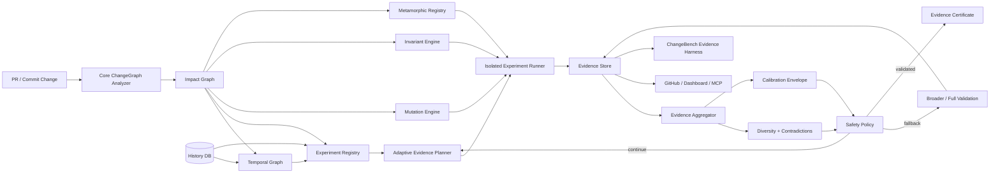

# ChangeGraph Evidence Science Architecture

This document translates the Evidence Science design into concrete runtime boundaries, data flow, persistence, algorithms, and security properties.

## 1. Architecture goals

In order:

1. preserve ChangeGraph safety invariants;
2. keep every evidence claim reproducible and provenance-linked;
3. support adaptive/sequential validation without introducing black-box authority;
4. keep research models replaceable behind versioned interfaces;
5. make historical evaluation leak-resistant by construction;
6. expose enough internal state for scientific ablation and debugging.

---

## 2. Topology



The adaptive planner never calls GitHub/MCP/LLM transports directly. Transport layers consume immutable evidence/report objects.

---

## 3. Package boundaries

```text
packages/
  evidence/      canonical evidence, aggregation, diversity, contradictions
  temporal/      time-aware graph observations and propagation channels
  experiments/   experiment registry, costs, planner, frontier
  mutation/      bounded mutant generation/execution interpretation
  calibration/   support region, calibration artifacts, shift diagnostics
  invariants/    likely-invariant mining/evaluation
  metamorphic/   relation lifecycle and execution
  provenance/    actor/evidence provenance and independence groups
  attestation/   Merkle evidence root and certificate predicate
```

Cross-package rule: packages may depend on shared core report/types, but no package may import from `apps/web`, MCP, GitHub UI, or Copilot-agent code.

---

## 4. Data model additions

### Evidence records

PostgreSQL tables:

`evidence_items`
- `id`
- `schema_version`
- `repository_id`
- `base_sha`
- `head_sha`
- `modality`
- `subject_ids_json`
- `outcome`
- `strength`
- `independence_group`
- `producer`
- `producer_version`
- `actor_type`
- `independent_of_change_author`
- `payload_digest`
- `payload_json`
- `created_at`

Unique constraint:

`(repository_id, head_sha, id)`

### Experiments

`validation_experiments`
- identity/config digest;
- kind;
- estimated cost/source/sample count;
- status;
- started/completed time;
- exact runner/version;
- result digest.

### Temporal edges

`temporal_edge_observations`
- stable edge key;
- first/last commit/time;
- observation count;
- failure associations;
- trace associations;
- mutation associations;
- causal evidence level.

### Calibration

`calibration_envelopes`
- model/version;
- repository/change regime;
- alpha/target;
- sample count;
- support-region digest;
- observed miscoverage;
- valid-from/as-of cutoff;
- status.

### Invariants/MRs

Store lifecycle state, support observations, counterexamples, and exact versioned executable definitions.

---

## 5. Evidence state

```ts
export interface EvidenceState {
  items: EvidenceItem[];
  subjects: Record<string, SubjectEvidenceSummary>;
  modalities: Record<EvidenceModality, number>;
  independenceGroups: Record<string, number>;
  diversity: number;
  contradictions: EvidenceContradiction[];
  requiredMissing: string[];
  calibration: CalibrationDecision;
}
```

This object is immutable per planner iteration. Each new experiment result creates a new evidence-state version.

Persist iteration history so an analysis can be replayed exactly.

---

## 6. Adaptive planner loop

```ts
while (true) {
  const state = aggregateEvidence(items);
  const decision = shouldStopValidation(state, policy);

  if (decision.kind !== 'continue') return decision;

  const candidates = registry.available(context, state);
  const next = chooseNextExperiment(state, candidates, policy);

  if (!next) return { kind: 'fallback', reason: 'no-viable-experiment' };

  const result = await runner.execute(next);
  items.push(...evidenceFromExperiment(next, result));
}
```

### Planner guardrails

- max evidence-step count;
- max wall-clock/compute budget;
- mandatory experiment precedence;
- hard fallback precedence;
- no negative-cost/zero-cost loops;
- repeated identical experiment suppressed unless policy explicitly requests retry;
- planner decision trace persisted.

---

## 7. Expected uncertainty reduction baseline

Do not pretend to know Bayesian uncertainty before a validated probabilistic model exists.

The first implementation uses an explicit **evidence-gap score** as the uncertainty surrogate.

For experiment `e`:

```text
gain(e) =
  0.35 * uncoveredAffectedSubjects
+ 0.25 * historicalFaultRelevance
+ 0.20 * evidenceModalityNovelty
+ 0.10 * mutationGapRelevance
+ 0.10 * experimentReliability
```

All terms normalized `[0,1]` and returned in trace.

```text
utility(e) = gain(e) * (1 + diversityGain(e)) / max(costNorm(e), 0.01)
```

This baseline exists to be falsified by ChangeBench.

---

## 8. Minimum Evidence plan vs online planner

Two related outputs:

### Forecast plan

Before running evidence, greedily estimate a minimum sufficient set for UI/CI planning.

### Online planner

After each actual result, recompute from observed state.

The online planner is authoritative for adaptive mode. Forecast plans are estimates and visibly labeled.

---

## 9. Temporal graph architecture

Maintain snapshot graph from the core analyzer plus temporal aggregate tables.

Do not materialize one giant graph database initially.

For one PR:

1. load current static graph;
2. query temporal observations only for affected/neighbor stable keys;
3. enrich edge/node features in memory;
4. persist new observations after analysis/full validation;
5. update channel aggregates asynchronously after authoritative results are known.

This avoids a graph database until measured query requirements justify one.

---

## 10. Mutation engine execution

Mutations execute in disposable test-runner isolation.

Flow:

```text
head checkout
-> generate one deterministic mutant
-> apply in disposable workspace
-> typecheck/compile if required
-> run selected validation tests
-> optionally run broader witness tests
-> restore/destroy workspace
-> record witness evidence
```

Never apply mutants to the canonical worker checkout.

Parallel mutation workers must have explicit CPU/memory/concurrency budgets.

---

## 11. Invariant instrumentation

Initial TypeScript approach should prefer explicit probes around affected exported functions/routes rather than whole-process instrumentation.

Probe payloads are schema-limited scalar/shape data, not arbitrary object dumps.

Sensitive values must be redacted/hash-transformed according to repository policy before persistence.

Invariant mining happens offline from successful historical probe records, never inline in the request path.

---

## 12. Metamorphic execution

An accepted executable relation defines:

```ts
export interface MetamorphicRelation {
  id: string;
  version: string;
  scope: string[];
  transform: TransformDefinition;
  relation: RelationDefinition;
  lifecycle: MRStatus;
  supportRuns: number;
  counterexamples: number;
}
```

Transforms execute in the same isolated runner boundary as tests.

LLM-generated relation code must be treated as untrusted code and sandboxed.

---

## 13. Calibration boundary

Calibration is a service/package consumed by policy but cannot override policy.

```ts
export type CalibrationDecision =
  | { kind: 'inside-support'; envelopeId: string; diagnostics: ShiftDiagnostic[] }
  | { kind: 'outside-support'; diagnostics: ShiftDiagnostic[] }
  | { kind: 'insufficient-history'; diagnostics: ShiftDiagnostic[] };
```

`outside-support` and `insufficient-history` may never be coerced into Optimize acceptance by an LLM or UI override.

Repository owner may always request broader validation.

---

## 14. Evidence provenance

Normalize provenance from:

- GitHub actor metadata;
- Copilot/agent metadata where available;
- ChangeGraph remediation run IDs;
- workflow/job IDs;
- human review/override actions.

Unknown stays `unknown`.

Independence groups are based on shared origin and validation mechanism, not just actor label.

Example:

```text
changegraph-remediation-run:abc123
```

Production code and tests created in that one run share an independence group until external evidence exists.

---

## 15. Evidence Certificate

### Canonical records

Canonical EvidenceItem JSON -> SHA-256 leaf.

### Merkle tree

Sort leaves by evidence ID. Pair-hash recursively; for odd layer size duplicate-last or use a documented domain-separated odd-node rule. The chosen rule is versioned in the attestation schema.

### Predicate

Use a ChangeGraph-owned predicate namespace, not SLSA's provenance predicate.

### Signing

First implementation can emit unsigned deterministic predicates for local verification. GitHub/Sigstore-backed signing becomes a separate integration milestone for release/artifact workflows.

---

## 16. ChangeBench architecture

Historical evaluator API always carries:

```ts
export interface ReplayContext {
  repository: RepositoryRef;
  targetCommit: string;
  asOfInstant: string;
  allowedHistoryEndCommit: string;
  datasetVersion: string;
}
```

Every history store query requires `asOf`/cutoff.

A benchmark package that exposes unrestricted `getAllHistory()` to a replay model fails architectural review.

### Frozen outputs

Store:

- dataset manifest;
- included/excluded cases with predeclared reason;
- tool commit;
- config/model versions;
- raw per-case results;
- aggregate report;
- environment/runtime metadata.

---

## 17. Observability

New spans:

```text
changegraph.temporal.query
changegraph.experiment.plan
changegraph.experiment.execute
changegraph.evidence.aggregate
changegraph.mutation.generate
changegraph.mutation.execute
changegraph.calibration.assess
changegraph.invariant.evaluate
changegraph.metamorphic.execute
changegraph.attestation.build
```

New metrics:

- experiments per validation;
- planner overhead;
- evidence diversity;
- contradiction count;
- mutation survivors;
- calibration outside-support rate;
- adaptive stop/fallback reasons;
- certificate build/verify failures.

Do not put source content/secrets into telemetry.

---

## 18. Security boundaries

### Untrusted inputs

- repository source;
- test commands/config;
- mutant code;
- invariant probe data;
- metamorphic transform code;
- PR descriptions/agent prompts;
- MCP/tool arguments.

### Required isolation

Untrusted code executes only in sandbox/runner infrastructure with:

- filesystem boundary;
- resource limits;
- timeout;
- output cap;
- constrained network policy;
- short-lived credentials when unavoidable;
- guaranteed cleanup.

### Attestation integrity

Evidence payload digests are computed before storage and checked before certificate construction.

---

## 19. Learned-model interface

A learned challenger may implement:

```ts
export interface EvidenceRanker {
  version: string;
  rank(context: PlannerContext, candidates: ValidationExperiment[]): Promise<RankedExperiment[]>;
}
```

Policy consumes only experiments/results/evidence, not opaque model claims of safety.

The deterministic baseline remains available for rollback and ablation.

---

## 20. Deployment sequencing

Do not deploy all research features simultaneously.

Recommended production order:

1. temporal/history read-only features in Observe mode;
2. mutation witness reports in Observe mode;
3. adaptive planner shadow recommendations;
4. evidence frontier UI;
5. calibration abstention;
6. owner-enabled adaptive execution on proven repositories;
7. invariants in Observe mode;
8. metamorphic relations in shadow mode;
9. evidence certificates;
10. learned challengers only after frozen benchmark evidence.

Every transition has rollback to broader/full validation.
