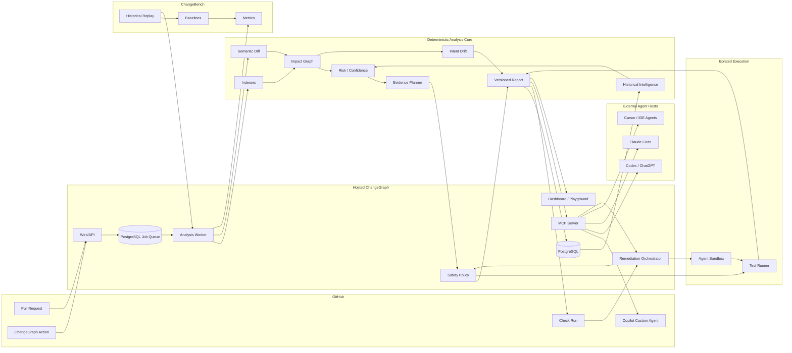

# ChangeGraph Platform Architecture

This document extends `docs/ARCHITECTURE.md` with the architecture required for ChangeGraph MCP, GitHub Copilot custom agents, ChangeBench, Intent Drift, Minimum Evidence Testing, and Marketplace distribution.

The existing deterministic analysis core remains the foundation. None of these surfaces may bypass risk, confidence, evidence provenance, or safety policy.

---

# 1. Extended topology



---

# 2. New repository layout

The expansion adds new bounded packages and apps rather than placing agent logic into the existing web application.

```text
changegraph/
├── apps/
│   ├── web/
│   ├── worker/
│   ├── cli/
│   ├── mcp/
│   └── playground/
├── packages/
│   ├── ... existing core packages ...
│   ├── intent/
│   ├── evidence-optimizer/
│   ├── trust/
│   ├── provenance/
│   ├── mcp-tools/
│   ├── remediation/
│   └── marketplace/
├── agents/
│   └── changegraph-reviewer.agent.md
├── benchmarks/
│   ├── changebench/
│   ├── baselines/
│   └── datasets/
├── docs/
└── .github/
```

## Boundary rules

- `apps/mcp` exposes transport only; business logic lives in packages.
- `packages/mcp-tools` converts domain services to tool schemas.
- `packages/intent` never calls an LLM as part of safety policy.
- `packages/evidence-optimizer` consumes candidate evidence and constraints, not raw repository code.
- `packages/trust` consumes benchmark/shadow metrics and emits trust state.
- `packages/remediation` can request isolated work but cannot directly edit the checked-out production workspace.
- `agents/` contains declarative GitHub Copilot profiles only.
- `benchmarks/changebench` reuses the exact production analyzer packages to avoid benchmark-only implementations.

---

# 3. MCP server architecture

ChangeGraph targets the MCP 2026-07-28 protocol line through the current TypeScript SDK.

## 3.1 Transport modes

### Local / stdio

Useful for local CLI/IDE experiments.

```text
MCP host -> stdio -> changegraph-mcp -> local ChangeGraph CLI/core
```

### Remote HTTP

Preferred hosted architecture.

```text
MCP host -> HTTPS /mcp -> auth -> repository scope -> tool router -> domain service
```

The remote server should remain stateless at the protocol edge. Durable ChangeGraph state lives in PostgreSQL/object storage, not transport sessions.

## 3.2 Tool contract

```ts
export interface ToolContext {
  principal: Principal;
  installationId?: number;
  repository: RepositoryRef;
  requestId: string;
}

export interface ChangeGraphTool<I, O> {
  name: string;
  inputSchema: JSONSchema;
  outputSchema: JSONSchema;
  access: 'read' | 'request-write';
  execute(context: ToolContext, input: I): Promise<O>;
}
```

## 3.3 Authorization

Tool authorization occurs before domain execution.

```text
request
  -> authenticate principal
  -> resolve installation/repository
  -> verify repository membership/installation scope
  -> verify tool access class
  -> execute
```

Repository IDs supplied by clients are never trusted as authorization evidence.

## 3.4 Read-only tool set

Initial allowlisted tools:

```text
analyze_change
get_changed_symbols
get_impact_paths
get_relevant_tests
get_risk
get_confidence
get_repository_trust
get_hotspots
compare_intent_to_impact
minimum_evidence_plan
```

They may create/cache an analysis job but they do not modify source or branch state.

## 3.5 Request-write tools

Later tools return request objects:

```ts
interface RemediationRequestReceipt {
  requestId: string;
  status: 'queued' | 'rejected';
  policyReasons: string[];
}
```

They never return "fix applied" synchronously.

---

# 4. GitHub Copilot custom agent

The repository ships a profile such as:

```text
agents/changegraph-reviewer.agent.md
```

The profile is designed for `github-copilot` and explicitly allowlists ChangeGraph MCP tools.

Conceptual profile:

```yaml
---
name: changegraph-reviewer
description: Uses ChangeGraph evidence to analyze blast radius, test requirements, intent drift, and confidence for code changes.
target: github-copilot
tools:
  - read
  - search
  - changegraph/analyze_change
  - changegraph/get_impact_paths
  - changegraph/get_relevant_tests
  - changegraph/get_risk
  - changegraph/get_confidence
  - changegraph/compare_intent_to_impact
  - changegraph/minimum_evidence_plan
mcp-servers:
  changegraph:
    type: http
    url: ${CHANGEGRAPH_MCP_URL}
    tools:
      - analyze_change
      - get_impact_paths
      - get_relevant_tests
      - get_risk
      - get_confidence
      - compare_intent_to_impact
      - minimum_evidence_plan
---
```

The committed profile used by this repository may use local development configuration. Hosted users configure the MCP URL and credentials according to their environment.

## Agent rule

The custom agent is a **consumer of evidence**, not an alternative analyzer.

It is forbidden to transform "ChangeGraph confidence 0.61" into "this looks safe anyway." Low confidence must remain low confidence.

---

# 5. GitHub Check actions

The GitHub App's Checks integration becomes an interaction surface.

```ts
type RequestedActionId =
  | 'run_full_suite'
  | 'generate_regression_test'
  | 'investigate_impact'
  | 'attempt_candidate_fix';
```

## Event flow

```text
user clicks Check action
  -> check_run.requested_action webhook
  -> verify webhook
  -> resolve exact check/report/head SHA
  -> authorize requested action
  -> policy decision
  -> enqueue job
  -> update Check with action status
```

A requested action is always bound to the exact analysis/report/head SHA from which it was triggered. If the PR head has advanced, mutation/remediation actions are rejected as stale and must be re-requested on the new analysis.

---

# 6. Repository trust architecture

```ts
export type RepositoryTrustState =
  | 'unproven'
  | 'observed'
  | 'calibrating'
  | 'trusted'
  | 'degraded'
  | 'suspended';

export interface RepositoryTrustAssessment {
  state: RepositoryTrustState;
  comparableRuns: number;
  failureRecall?: number;
  falseSafeEvents: number;
  systematicMissClasses: string[];
  indexHealth: number;
  adapterVersion: string;
  lastMaterialConfigChangeAt?: string;
  reasons: string[];
}
```

## Promotion

Promotion is deterministic and conservative.

Example default conditions for a **recommendation** to become trusted:

```text
comparable runs >= 50
failure recall >= 0.99
false-safe events == 0 during required recent window
no unresolved systematic miss class
index/adapter health within threshold
explicit repository-owner opt-in
```

A repository never auto-promotes from a benchmark score alone.

## Demotion

A serious false-safe event, adapter regression, major build/test configuration change, or unsupported topology change may move the repository to `degraded` or `suspended` immediately.

---

# 7. Intent Drift architecture

## Pipeline

```text
PR/issue/agent task
  -> intent collector
  -> structured intent extractor
  -> impact normalizer
  -> drift comparator
  -> evidence-linked drift report
```

The extraction phase may optionally use an LLM, but it must expose `extractionConfidence`, source text references, and structured fields.

The comparator is deterministic.

```ts
export interface IntentDriftFactor {
  key: string;
  severity: 'info' | 'low' | 'medium' | 'high';
  summary: string;
  evidenceIds: string[];
}

export interface IntentDriftAssessment {
  band: 'none' | 'low' | 'medium' | 'high';
  scopeExpansionRatio: number;
  factors: IntentDriftFactor[];
}
```

Intent drift contributes a review signal and may increase risk when it touches explicit critical boundaries, but intent text can never reduce risk.

---

# 8. Minimum Evidence Testing architecture

## 8.1 Evidence action model

```ts
export type EvidenceActionKind =
  | 'test'
  | 'suite'
  | 'typecheck'
  | 'lint'
  | 'build'
  | 'schema-check'
  | 'sentinel'
  | 'full-suite';

export interface EvidenceAction {
  id: string;
  kind: EvidenceActionKind;
  estimatedCostMs: number;
  coversEvidenceIds: string[];
  estimatedMarginalConfidence: number;
  mandatory: boolean;
}
```

## 8.2 Plan

```ts
export interface EvidencePlan {
  targetConfidence: number;
  startingConfidence: number;
  projectedConfidence: number;
  selected: EvidenceAction[];
  estimatedCostMs: number;
  fullSuiteEstimatedCostMs?: number;
  constraints: string[];
  algorithmVersion: string;
}
```

## 8.3 Conservative greedy algorithm

1. Add all mandatory actions.
2. Recalculate covered evidence.
3. For each candidate, estimate non-overlapping marginal confidence gain.
4. Compute `gain / cost`.
5. Select the highest value candidate.
6. Recalculate overlap and confidence.
7. Stop when target is reached.
8. If target cannot be reached safely, choose full-suite fallback.

This algorithm is intentionally transparent and easy to benchmark.

No optimization step may remove a protected safety requirement.

---

# 9. ChangeBench architecture

ChangeBench is both a package and a dataset/provenance discipline.

## Components

```text
benchmarks/changebench/
  src/cases/
  src/replay/
  src/metrics/
  src/report/
  src/provenance/
benchmarks/baselines/
benchmarks/datasets/
```

## Replay interface

```ts
export interface BenchmarkSystem {
  name: string;
  version: string;
  predict(caseInput: BenchmarkInput): Promise<BenchmarkPrediction>;
}
```

ChangeGraph and every baseline implement the same interface.

## Result provenance

Each published result records:

- dataset version;
- repository and license/source metadata;
- case count;
- tool commit SHA;
- configuration hash;
- model version if any;
- date;
- machine/runtime characteristics for latency/runtime results.

## Historical leakage guard

Every history query takes `asOf`.

```ts
getHistorySignal(repositoryId, changedArea, testId, asOfTimestamp)
```

Benchmark code must reject history records newer than the case's analysis timestamp.

---

# 10. Public playground architecture

The playground is a separate, heavily constrained application surface.

## Request

```text
public GitHub PR URL
```

## Flow

```text
URL validation
 -> public repo resolution
 -> rate limit
 -> cached report by base/head/indexer version
 -> read-only analysis job
 -> sanitized public report
```

No installation secrets or private-repository features are involved.

The public report omits private operational metadata and retains only analysis evidence obtainable from the public repository.

---

# 11. Marketplace architecture requirements

Marketplace constraints affect architecture early.

The hosted app must have stable public URLs for:

```text
/privacy
/terms
/support
/pricing
/status or public status provider
/docs/install
/docs/uninstall
```

The service must process Marketplace plan/cancellation events before a Marketplace App listing is submitted, even if the initial plan is free where GitHub's current requirements still expect plan-change/cancellation webhook readiness.

The GitHub Action is released from a separate public repository with one root `action.yml` when Marketplace publication begins.

---

# 12. Observability

New spans:

```text
mcp.authenticate
mcp.authorize_repository
mcp.tool_call
intent.extract
intent.compare
trust.assess
evidence.optimize
check.requested_action
remediation.request
changebench.replay
changebench.baseline
changebench.metrics
marketplace.event
```

New metrics:

```text
mcp_tool_calls_total
mcp_tool_denied_total
mcp_tool_latency_ms
intent_drift_high_total
evidence_plan_cost_ratio
trust_state_transition_total
requested_action_total
remediation_rejected_stale_total
changebench_failure_recall
changebench_false_safe_rate
marketplace_installation_total
```

No code contents, secrets, agent prompts, or full PR bodies go into telemetry by default.

---

# 13. Deployment sequence

The platform surfaces deploy in this order:

1. deterministic MVP;
2. hosted GitHub advisory App;
3. shadow calibration;
4. read-only MCP server;
5. ChangeGraph Copilot custom agent;
6. ChangeBench public benchmark;
7. Intent Drift;
8. Minimum Evidence planner;
9. interactive Check actions;
10. isolated remediation;
11. public playground;
12. GitHub Marketplace App listing;
13. GitHub Marketplace Action listing;
14. paid plans only after evidence and adoption justify them.

This ordering ensures that distribution never outruns safety and product credibility.
